# MarpBoilerplatesAndThemes
Repository for [Marp](https://marp.app) Boilderplates and Themes

##  Build

```
npm run build-all
```

---

## Minimal

A minimalistic black & white theme.

### Download

[minimal.css](./themes/minimal.css)

### Usage

#### CLI

```
npx marp --theme minimal.css presentation.md
```

#### Marp for VS Code

```
---
marp: true
theme: diabolo
---
```

```json
// Please put `.vscode/settings.json` on your workspace
{
  "markdown.marp.themes": [
    "./path/to/minimal.css"
  ]
}
```

### Preview

|**Title**|**Headings**|**Itemization**|
|:-:|:-:|:-:|
||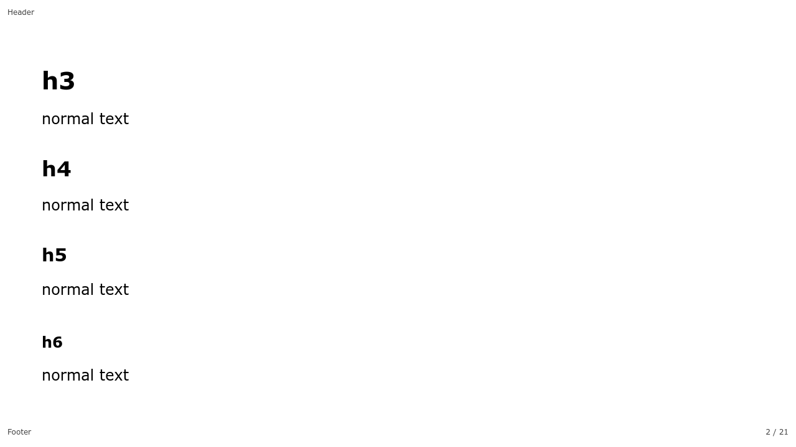||
|**Grouped Itemization**|**Enumeration**|**Grouped Enumeration**|
||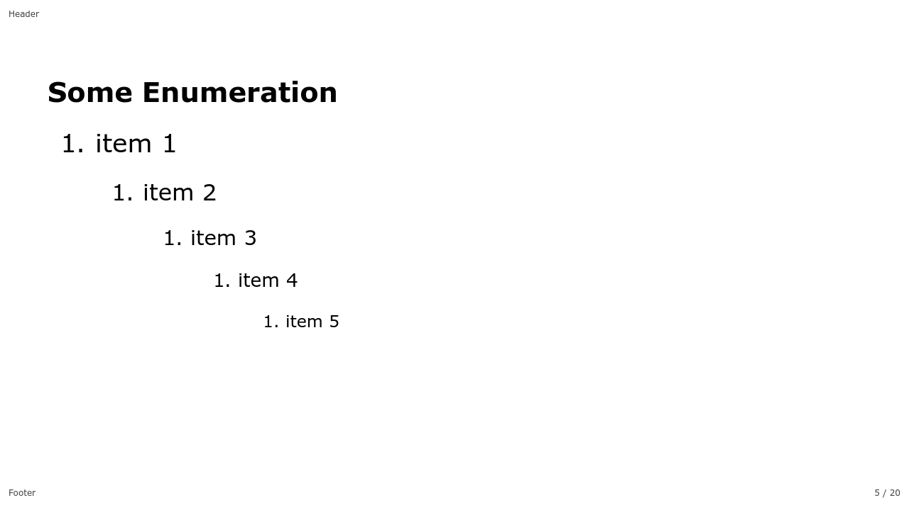|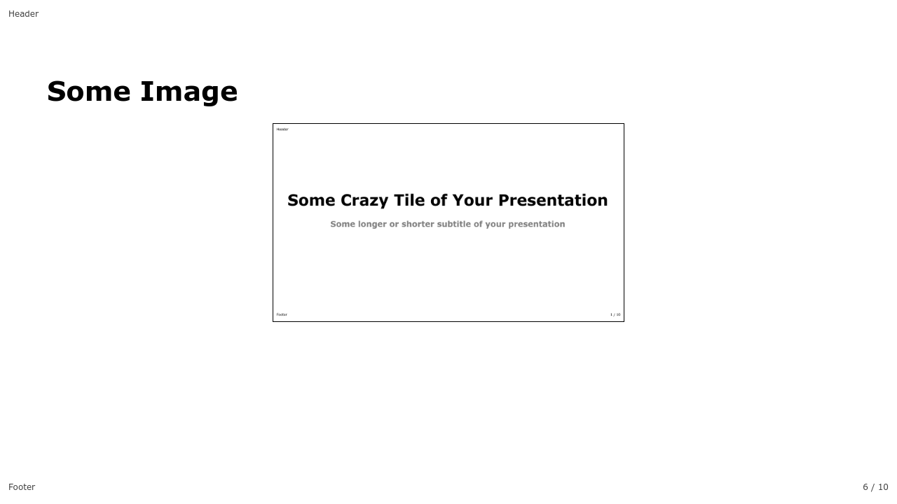|
|**Mixed List**|**Hyperlink**|**Image**|
|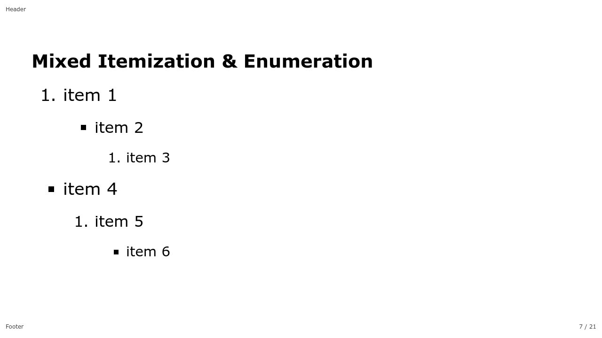|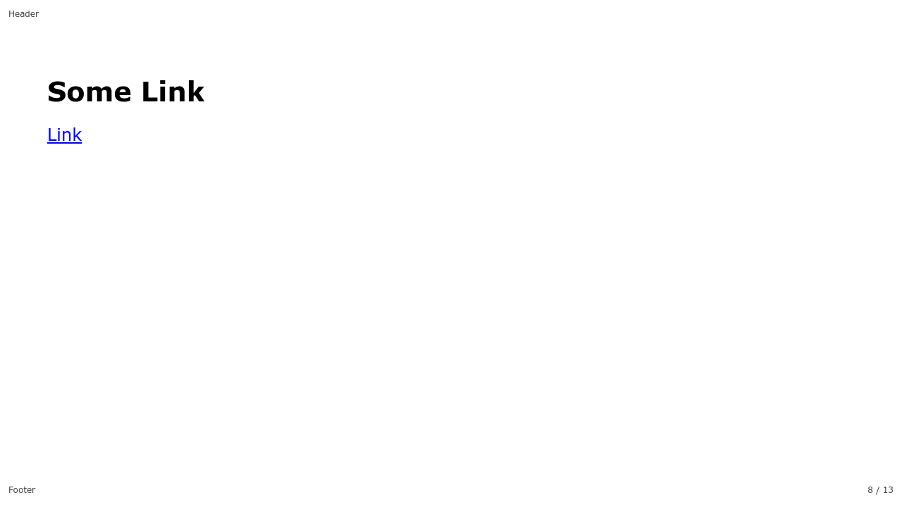|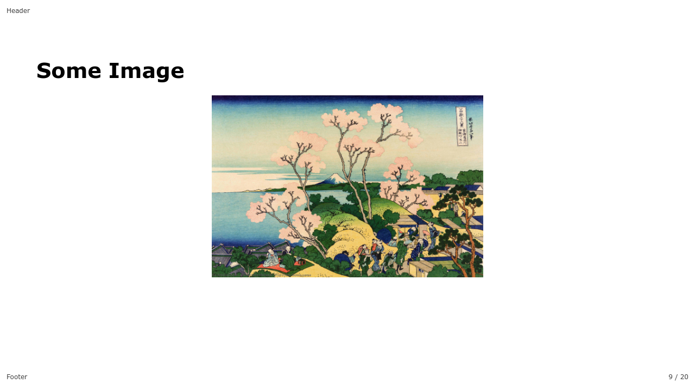|
|**Blockquote**|**Table**|**Inline Code**|
|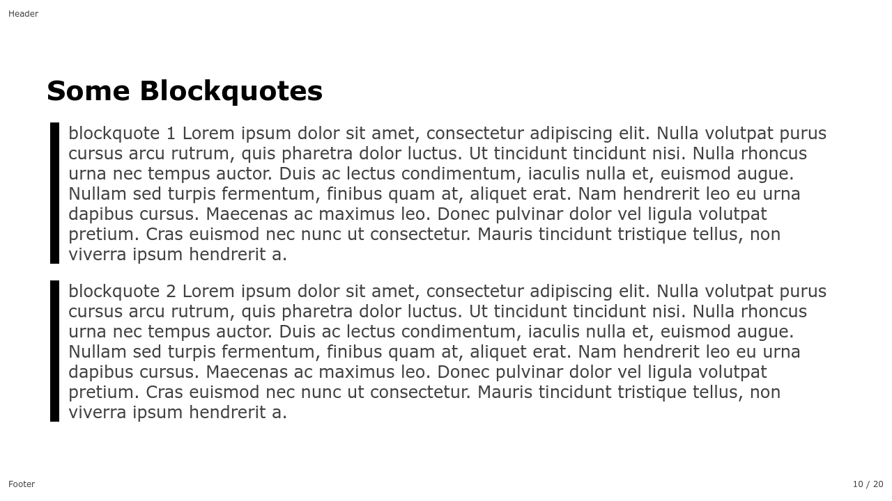|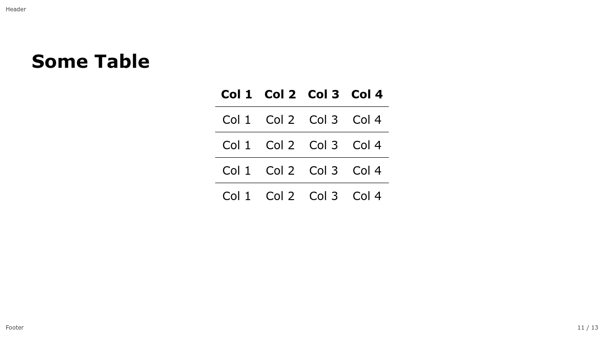|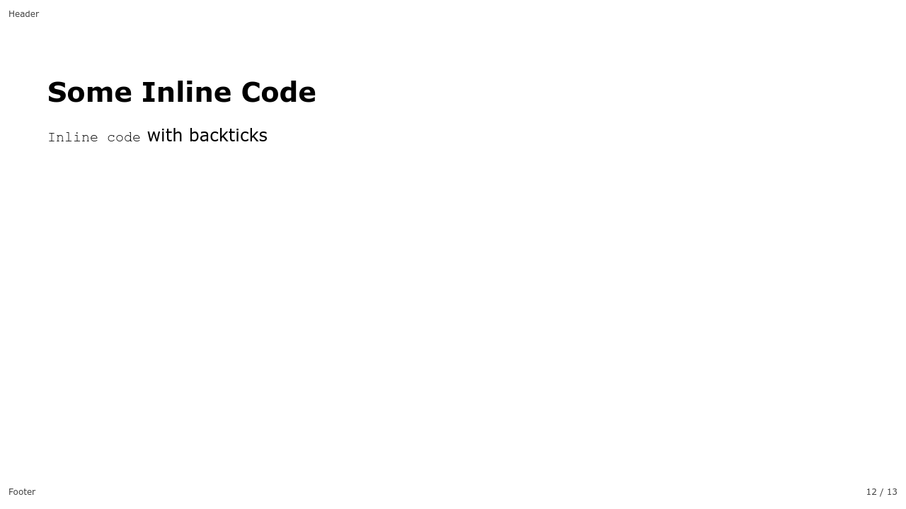|
|**Code Block**|**Some Larger Code Block**|**Some Inline Math**|
|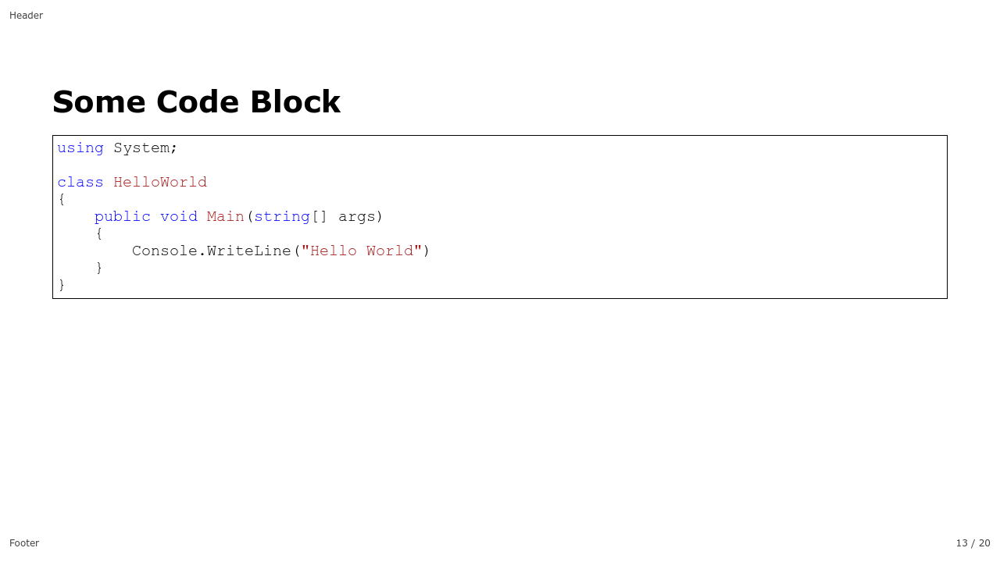|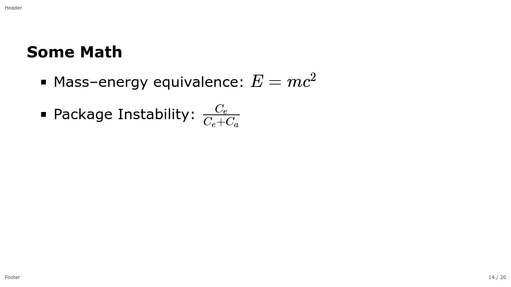|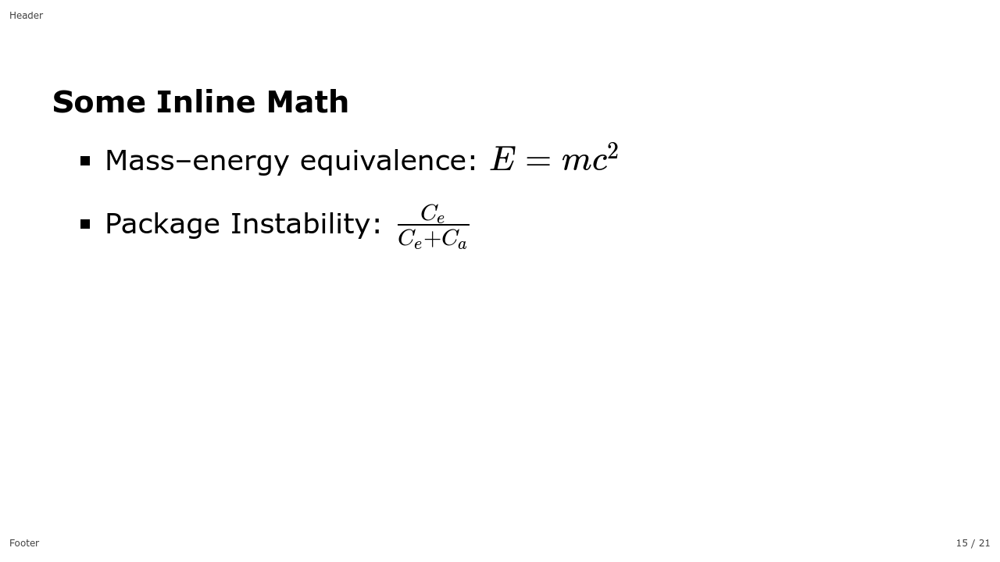|
|Some Math Blocks|**Background Image**|**Split Background (Right)**|
|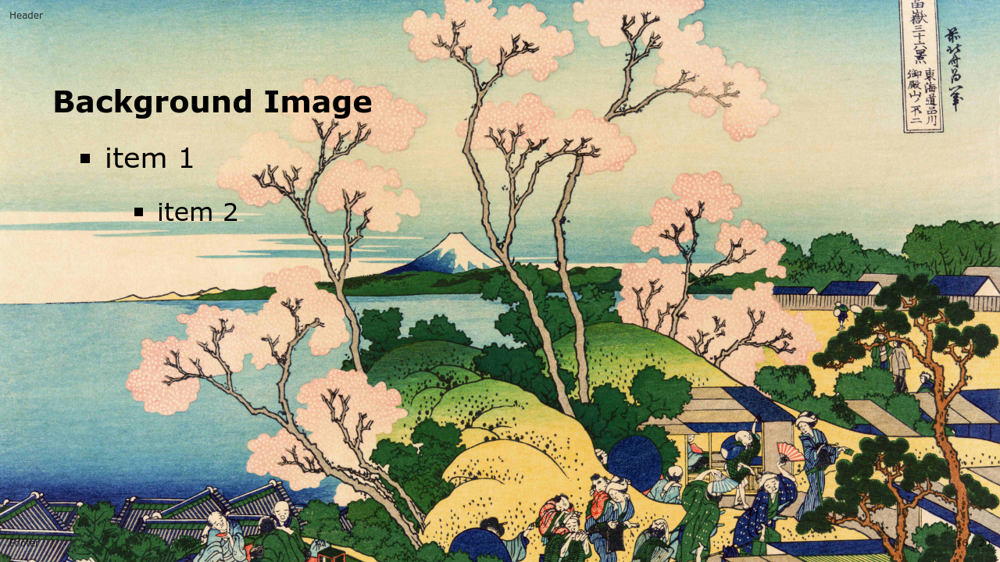|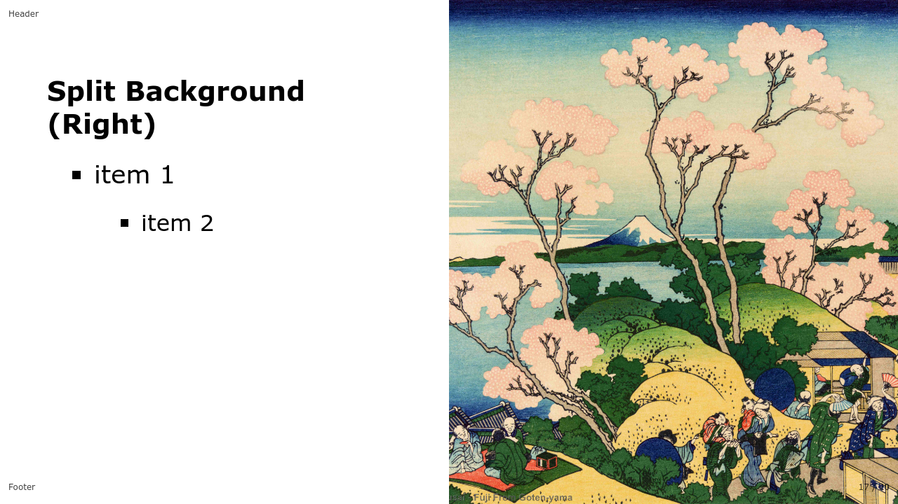|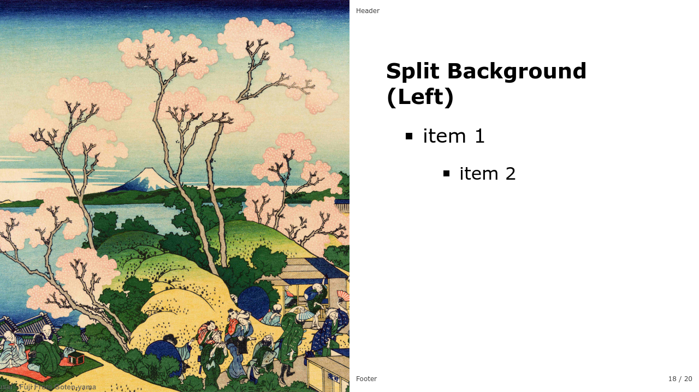|
|**Split Background (Left)**|**Split Background (Right Scaled)**|**Multiple Background**|
|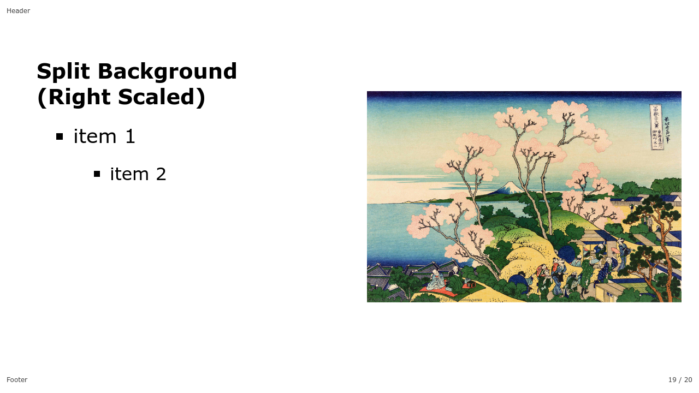|||